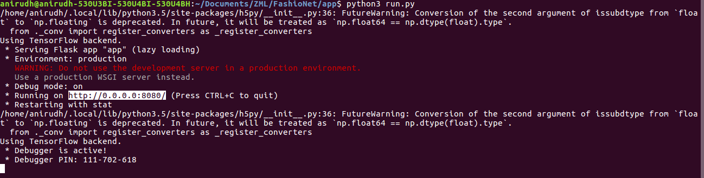

# Web Application

## Running the server
To run the server, run the command: \

> python3 run.py

Open the link on which the server has been hosted. This will be displayed after running the above line.
  
